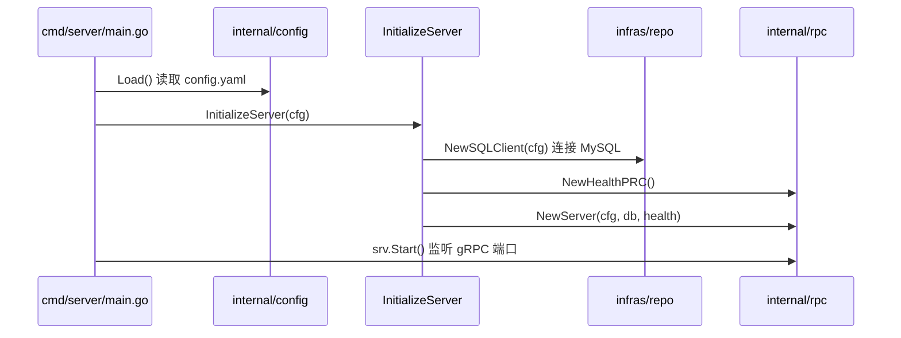
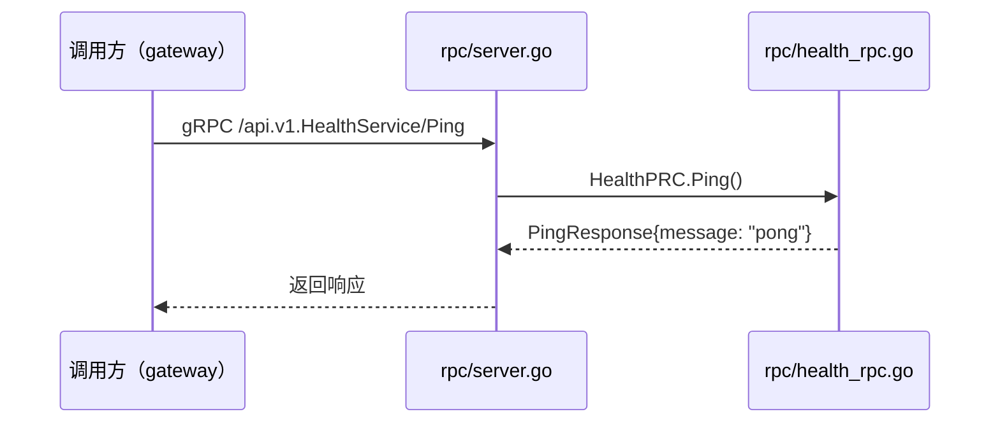

# core-server

Renai 项目的核心业务微服务，对外暴露 gRPC 接口，负责领域逻辑与数据持久化。

## 技术栈

| 类别 | 技术 | 说明 |
|------|------|------|
| 语言 | Go 1.26 | |
| RPC 框架 | [gRPC](https://grpc.io/) | 服务间通信，当前监听 `127.0.0.1:8081` |
| 接口定义 | Protocol Buffers | `docs/proto/*.proto` 定义 RPC 契约 |
| 依赖注入 | [Google Wire](https://github.com/google/wire) | 编译期 DI，生成 `cmd/server/wire_gen.go` |
| ORM | [GORM](https://gorm.io/) | 数据库访问层 |
| 数据库 | **MySQL** | 通过 `gorm.io/driver/mysql` 连接，库名 `renai` |
| 配置 | YAML | `gopkg.in/yaml.v3` 读取 `config/config.yaml` |

> Redis：`internal/config/conf_redis.go` 已预留配置结构，**尚未接入**，当前未使用。

## 快速启动

```bash
# 1. 确保 MySQL 已启动，并创建数据库 renai
# 2. 修改 conf/conf.yaml 中的数据库账号密码

cd core-server
go mod tidy
make wire                  # 重新生成依赖注入代码（可选）
make generate-proto-rpc    # 修改 proto 后重新生成 pb 代码
go run ./cmd/server
```

## 目录结构

```
core-server/
├── cmd/
│   ├── server/                 # 服务入口
│   │   ├── main.go             # 加载配置 → Wire 初始化 → 启动 gRPC → 优雅关闭
│   │   ├── wire.go             # Wire 注入定义
│   │   └── wire_gen.go         # Wire 自动生成（勿手改）
│   └── cli/                    # 命令行工具（预留）
├── config/
│   └── config.yaml             # 服务端口、MySQL 连接配置
├── docs/
│   └── proto/                  # Protobuf 源文件
│       └── health.proto
├── internal/
│   ├── config/                 # 配置加载
│   │   ├── config.go           # Config / ServerConfig，Load()
│   │   ├── conf_mysql.go       # MySQLConfig、DSN()
│   │   └── conf_redis.go       # Redis 配置（预留）
│   ├── domain/                 # 领域层（DDD）
│   │   ├── model/
│   │   │   ├── entity/         # 实体，如 User
│   │   │   └── aggregate/      # 聚合根（预留）
│   │   └── user_domain/        # 用户领域接口
│   ├── application/            # 应用层（用例编排）
│   │   ├── wire.go
│   │   └── user_svc/           # 用户相关业务用例
│   ├── infras/                 # 基础设施层
│   │   ├── wire.go
│   │   └── repo/               # 仓储实现
│   │       ├── sqlclient.go    # GORM + MySQL 连接、AutoMigrate
│   │       └── user_impl.go    # User 仓储实现
│   └── rpc/                    # gRPC 接入层
│       ├── server.go           # gRPC Server 注册与启停
│       ├── health_rpc.go       # Health RPC 实现
│       ├── wire.go
│       └── healthpb/           # protoc 生成的 pb / grpc 代码
├── Makefile
├── go.mod
└── go.sum
```

## 分层职责

```
┌─────────────────────────────────────────┐
│  rpc/          gRPC Handler，协议转换    │
├─────────────────────────────────────────┤
│  application/  业务用例编排              │
├─────────────────────────────────────────┤
│  domain/       领域模型与仓储接口         │
├─────────────────────────────────────────┤
│  infras/repo/  MySQL 仓储实现（GORM）    │
└─────────────────────────────────────────┘
```

- **rpc**：接收 gRPC 请求，调用 application 层，返回 pb 响应。
- **application**：组合 domain 接口完成业务用例（如 Login）。
- **domain**：定义实体与仓储接口，不依赖具体数据库。
- **infras**：MySQL 连接、表迁移、仓储具体实现。

## 启动与跳转逻辑

### 服务启动链路



Wire 注入顺序（`wire_gen.go`）：

1. `repo.NewSQLClient(cfg)` — 连接 MySQL，AutoMigrate `User` 表
2. `rpc.NewHealthPRC()` — 创建 Health RPC Handler
3. `rpc.NewServer(cfg, sqlClient, healthPRC)` — 注册 gRPC Service 并启动

### Health Ping 请求链路（gRPC）

以 `HealthService.Ping` 为例：



代码跳转：

```
gRPC 请求
  → internal/rpc/server.go          RegisterHealthServiceServer
  → internal/rpc/health_rpc.go    HealthPRC.Ping()
  → 返回 healthpb.PingResponse
```

> 当前 Health 为占位实现，直接返回 `"pong"`，尚未调用 application / domain 层。

### 新增 RPC 服务的推荐步骤

1. 在 `docs/proto/` 新增或扩展 `.proto` 文件
2. 执行 `make generate-proto-rpc` 生成 `healthpb/` 同类目录
3. 在 `internal/rpc/` 新增 `xxx_rpc.go` 实现 Handler
4. 在 `internal/rpc/server.go` 的 `Register...Server` 处注册
5. 在 `internal/rpc/wire.go` 加入 Provider
6. 执行 `make wire` 更新注入代码

## 配置说明

```yaml
server:
  addr: "127.0.0.1:8081"    # gRPC 监听地址

Mysql:
  Host: "127.0.0.1"
  Port: "3306"
  username: "root"
  password: "123456"
  dbname: "renai"
  Max_Idle_Conn: 10
  Max_Open_Conn: 100
```

## 常用命令

| 命令 | 说明 |
|------|------|
| `go run ./cmd/server` | 启动服务 |
| `make wire` | 重新生成 Wire 注入代码 |
| `make generate-proto-rpc` | 从 proto 生成 gRPC 代码 |
